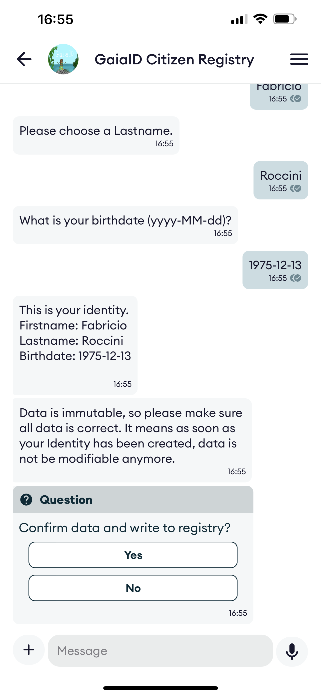

# Government Citizen Registry - Verifiable ID Card

## Purpose of the service

A demo module for building DIDcomm conversational services (chatbots) to issue Verifiable ID Cards to citizens by verifying their face against photo(s) stored in a database.

Using a conversational service for issuing Verifiable Credentials has many benefits:

- **time needed** for developing the service is reduced.
- **security**: it is more secure that issuing a credential through a web browser, as in our case everything is exchanged over a secure DIDComm session, no javascript, no cookies.
- **security**: it is only required to open the TCP port of the DIDComm service.

A conversational DIDComm service is probably **the most secure way of delivering Verifiable Credentials**.

In these demos, and because we are not connected to a true government database of citizens, you use the conversational service to create a fake digital Identity that you protect with your face biometrics. A corresponding Verifiable Credential of your Identity is issued to you.

Then, as soon as you've got you Verifiable Credential, you can use it to identify yourself and access passwordless services such as the [biometric-authenticator]() demos.

## Device lost, app uninstalled?

If you loose you cellphone or delete the App, then can restore your Identity by simply re-connecting to the same Registry service, verifying your face, and recover your Verifiable Credential.

## Service Architecture

Note: at the moment face capture/verification is performed by connecting to a web link. This will change in a near future when the 2060-webrtc module will be available and corresponding support added to the Hologram Wallet & Messenger App.

## Try the demo(s)

Several use cases of Citizen Registries have been deployed for your convenience. Just download the Hologram Messenger in the App Store or Google play and scan the QR code of the service you would like to try. All these demos are just an instance of the same citizen-registry service with customized settings. You can easily create your own demo for your country by jumping to the [kubernetes howto]() documentation.

### GaiaID Identity Registry

a government-like registry service. Test URL: [https://gaiaid.io](https://gaiaid.io)

#### Scan the QR code

#### Accept the Invitation
<kbd>

</kbd>

#### Create the Identity

Go to contextual menu and select "Create an Identity"

<kbd>

</kbd>

#### Capture your face

<kbd>

</kbd>

#### Verify your face

Now you verify your face, just to be sure capture was OK.

<kbd>

</kbd>

#### Receive your ID Card

<kbd>

</kbd>

### AvatarID Registry

create your Avatar and protect it with your face biometrics. Test URL: [https://avatar.demos.2060.io/qr](https://avatar.demos.2060.io/qr)

Service is similar to the GaiaID one.

## Deploy your own demo for your country

Go to the [kubernetes-howto](kubernetes/README.md) section.

## Setting up a development environment

Please refer to [these instructions](docker-dev/README.md).
