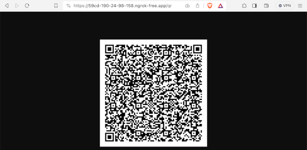
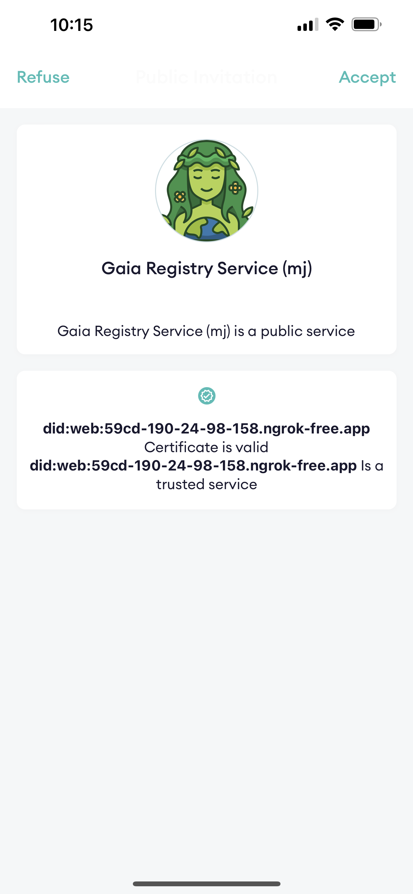
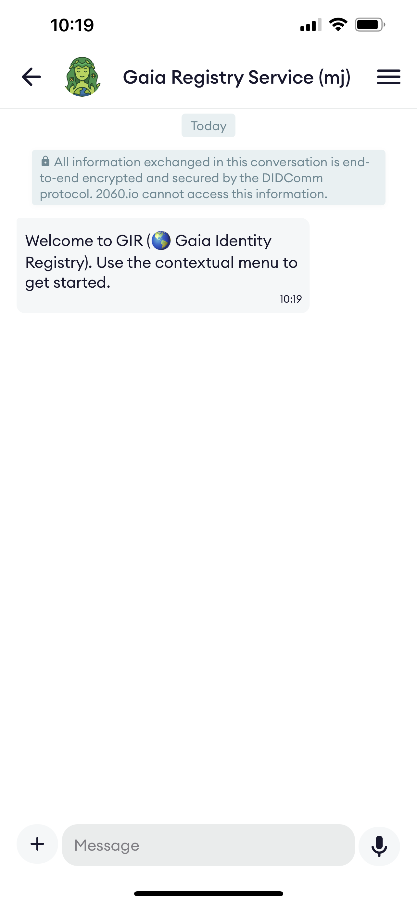

# Setting up a development environment with docker


In this document, you will learn how to setup a development environment for working/modifying the citizen-registry backend.
If you want to quickly deploy a clone or customize of one of the Citizen Registry demos, you'd better jump to the [kubernetes howto]() documentation.

## Setup a SSL port forwarding service

For being able to test your service directly from your cellphone, you will need a port forwarding service.
In this example, we will use the ngrok service. The free version of ngrok is enough for what we need.

First, follow installation instructions on ngrok web site. Then edit your ngrok config file, add your authtoken and configure the tunnel section with the following:

```
authtoken: <your ngrok token>
tunnels:
    serviceagent:
        addr: 3001
        proto: http
        schemes:
            - https
    backend:
        addr: 2903
        proto: http
        schemes:
            - https
    datastore:
        addr: 2904
        proto: http
        schemes:
            - https
version: "2"
region: us
```

Then, start ngrok service:

```
$ ngrok start
ngrok                                                                                                              (Ctrl+C to quit)

Build better APIs with ngrok. Early access: ngrok.com/early-access

Session Status                online
Account                       (Plan: Free)
Version                       3.5.0
Region                        United States (us)
Latency                       92ms
Web Interface                 http://127.0.0.1:4040
Forwarding                    https://04e8-190-24-98-158.ngrok-free.app -> http://localhost:2903
Forwarding                    https://11ee-190-24-98-158.ngrok-free.app -> http://localhost:2904
Forwarding                    https://59cd-190-24-98-158.ngrok-free.app -> http://localhost:3001
```

## Prepare docker-compose and start the containers

Copy the docker-compose-template file to docker.compose.yml and set your nrogk endpoints

```
version: '3.3'

services:
  artemis:
    image: apache/activemq-artemis
    ports:
      - "8161:8161"
      - "61616:61616"
      - "5672:5672"
    restart: unless-stopped
    environment:
      - ARTEMIS_USER=quarkus
      - ARTEMIS_PASSWORD=Quar2060enbPi26
    networks:
       - chatbot
    volumes:
      - /tmp/citizen-registry/artemis/artemis-instance:/var/lib/artemis-instance

# the service-agent is the container that will handle all the didcomm messaging.
# Your backend will use it to send and receive messages, receive new connection notifications, issue credentials, verify credentials,...
# Port 3000 provide an internal API for your backend and should only be visible by your backend. For details regarding the service agent API, go to http://localhost:3000 after having started the container.
# Port 3001 must be publicly available through a https public URL. DIDComm messaging App will connect to this public endpoint.
  service-agent:
    image: gitlab.mobiera.com:4567/2060/2060-service-agent:dev
    networks:
      - chatbot
    ports:
      - 3000:3000
      - 3001:3001
    environment:
# set service-agent did:web domain: here replace p3001.testing.2060.io with the ngrok domain name that will forward to port 3001
      - AGENT_PUBLIC_DID=did:web:p3001.testing.2060.io
# set service-agent websocket public endpoint: here replace p3001.testing.2060.io with the ngrok domain name that will forward to port 3001
      - AGENT_ENDPOINT=wss://p3001.testing.2060.io
# set service-agent agent websocket public endpoint: here replace p3001.testing.2060.io with the ngrok domain name that will forward to port 3001
      - ANONCREDS_SERVICE_BASE_URL=https://p3001.testing.2060.io
# set service-agent icon image: here replace p2903.testing.2060.io with the ngrok domain name that will forward to port 2903 (the backend project you will run locally)
# make sure an avatar.png image is present in src/main/resources/META-INF/resources of the backend project
      - AGENT_INVITATION_IMAGE_URL=https://p2903.testing.2060.io/avatar.png
# set service-agent service name
      - AGENT_NAME=Gaia Registry Service (mj)
      - USE_CORS=true
# where to send the receive events: here replace p2903.testing.2060.io with the ngrok domain name that will forward to port 2903 (the backend project you will run locally)
      - EVENTS_BASE_URL=https://p2903.testing.2060.io
    volumes:
       - /tmp/citizen-registry/afj:/root/.afj
  
  postgres:
    image: postgres:15.2
    networks:
      - chatbot
    ports:
      - 5432:5432
    environment:
      - POSTGRES_PASSWORD=2060demo
      - POSTGRES_USER=gaia 
      - PGDATA=/var/lib/postgresql/data/pgdata
    volumes:
       - /tmp/citizen-registry/postgresql:/var/lib/postgresql/data

# the datastore is the container that will store identity photos.
# Normally it should not be exposed directly to a public URL, 
# but for this demo, and for beeing able to use the face capture/face recognition service,
# we will need it.
  datastore:
    image: io2060/2060-datastore:main
    ports:
       - "2604:2604"
    restart: unless-stopped
    environment:
    - DEBUG=1
    - QUARKUS_HTTP_PORT=2604
    - IO_TWENTYSIXTY_DATASTORE_TMP_DIR=/tmp/data/tmp
    - IO_TWENTYSIXTY_DATASTORE_TMP_LIFETIMEDAYS=5
    - IO_TWENTYSIXTY_DATASTORE_REPO_LIFETIMEDAYS=43800
    - IO_TWENTYSIXTY_DATASTORE_REPO_FS_DIR=/tmp/data/repo
    - IO_TWENTYSIXTY_DATASTORE_MEDIA_MAXCHUNKS=128
    volumes:
       - /tmp/data:/tmp/data
    networks:
       - "chatbot"


networks:
  chatbot:
    ipam:
      driver: default
      config:
        - subnet: 172.28.0.0/27
```

Start the containers:

```
$ docker-compose up -d
```
verify containers are started:

```
$ docker ps
CONTAINER ID   IMAGE                                                 COMMAND                  CREATED         STATUS         PORTS                                                                                                               NAMES
8ed71159651b   io2060/2060-datastore:main                            "/usr/local/s2i/run"     3 seconds ago   Up 3 seconds   8080/tcp, 8443/tcp, 0.0.0.0:2904->2904/tcp, 8778/tcp                                                                docker-datastore-1
ee0e59f83606   apache/activemq-artemis                               "/docker-run.sh run"     3 seconds ago   Up 3 seconds   1883/tcp, 0.0.0.0:5672->5672/tcp, 5445/tcp, 9404/tcp, 0.0.0.0:8161->8161/tcp, 61613/tcp, 0.0.0.0:61616->61616/tcp   docker-artemis-1
100b146e717c   gitlab.mobiera.com:4567/2060/2060-service-agent:dev   "/bin/sh -c 'yarn st…"   3 seconds ago   Up 3 seconds   0.0.0.0:3000-3001->3000-3001/tcp                                                                                    docker-service-agent-1
12b7355f9b34   postgres:15.2                                         "docker-entrypoint.s…"   3 seconds ago   Up 3 seconds   0.0.0.0:5432->5432/tcp                                                                                              docker-postgres-1
```


## Edit application.properties and start Quarkus backend

edit src/main/resources/application.properties so that the vision service will know about your chatbot:

```
# here replace p3001.testing.2060.io with the ngrok domain name that will forward to port 2903 (the quarkus backend) 
%dev.io.gaiaid.vision.redirdomain.q=p2603.testing.2060.io
# here replace p3001.testing.2060.io with the ngrok domain name that will forward to port 2904 (the datastore container) 
%dev.io.gaiaid.vision.redirdomain.d=p2604.testing.2060.io
```
start quarkus:

```
$ ./mvnw clean quarkus:dev
```

### Scan the Agent QR Code with the Hologram App and start using your service

- With your browser, connect to the service-agent public endpoint (the ngrok URL that forwards to port 3001) and append /qr
- scan the QR code to create the connection



- accept the invitation and use the service

<kbd>


</kbd>
