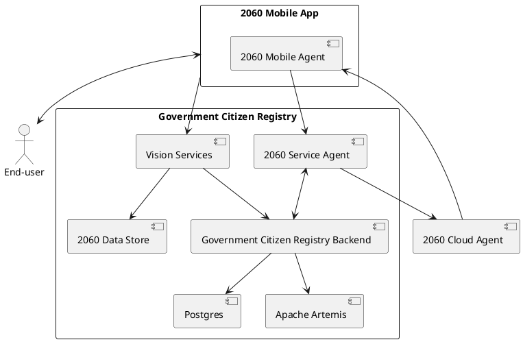

# Government Citizen Registry - Verifiable ID Card

A plug-in demo module for building a DIDcomm conversational service (chatbot) to deliver Verifiable ID Cards to citizen.
Configurable as a true government-ready service, or as an AvatarID service.


## Create your digital identity

In this demo, you create a digital Identity that you will protect with your face biometrics.

Get issued a verifiable credential of your identity. Present your credential to identify yourself and access passwordless services.

## Recover your identity

Lost your device? Flash again the service QR code and restore your Identity.

## Try Identity Registry

Flash QR with 2060 mobile App.

Demo services are provided with Vision Service module (face capture / recognition).


- [Gaia Registry](https://gaia.demos.m.2060.io/qr)

- [AvatarID](https://avatar.demos.m.2060.io/qr)

You can easily create your own demo by forking one of the demo projects registry-gaia, registry-avatar


## Government Citizen Registry architecture




## How to use API for Vision Service integration

Use the API if you want to integrate your own Vision Service.

### Face Recognition

#### New Identity

- Scan https://registry.dev.gaiaid.io/qr with the 2060 App
- Use the contextual menu and select "create a new identity"
- When bot requests a protection method, choose Face Recognition
- You will receive a URL with a token.

Keep track of this token. You'll need it later.

- Perform capture of user's face and use the datastore API https://d.registry.dev.gaiaid.io/q/swagger-ui/ to save the captured picture(s).
See datastore API' documentation on gitlab: https://gitlab.mobiera.com/2060/2060-data-store/-/tree/dev?ref_type=heads 
Save UUID of created media.

- call /link method of gaia's vision service API https://q.registry.dev.gaiaid.io/q/swagger-ui/ to link the created medias with the corresponding identity by using the token.
- call /success method to finish.
- in case of a problem (cannot capture, slow link,...), call /failure.
- done.

Use FACE for the type field of the API.


#### Verify user


- Scan https://registry.dev.gaiaid.io/qr with the 2060 App
- Use the contextual menu and select "restore an identity"
- When bot requests a protection method, choose Face Recognition
- You will receive a URL with a token.
- call /list method of gaia's vision service API https://q.registry.dev.gaiaid.io/q/swagger-ui/ to get the list of existing pictures of the identity represented by this token.
- perform face recognition.
- if face recognition is successful, call /success service. You can create new media links with /link at any time (for ex for each successful recognition).
- if face recognition does not work, call /failure

Use FACE for the type field of the API.


## Running the application in dev mode

Use the docker-compose example file in /docker to run artemis, postgres and the 2060-service-agent.

You can run your application in dev mode that enables live coding using:
```shell script
./mvnw compile quarkus:dev
```

> **_NOTE:_**  Quarkus now ships with a Dev UI, which is available in dev mode only at http://localhost:8080/q/dev/.

## Packaging and running the application

The application can be packaged using:
```shell script
./mvnw package
```
It produces the `quarkus-run.jar` file in the `target/quarkus-app/` directory.
Be aware that it’s not an _über-jar_ as the dependencies are copied into the `target/quarkus-app/lib/` directory.

The application is now runnable using `java -jar target/quarkus-app/quarkus-run.jar`.

If you want to build an _über-jar_, execute the following command:
```shell script
./mvnw package -Dquarkus.package.type=uber-jar
```

The application, packaged as an _über-jar_, is now runnable using `java -jar target/*-runner.jar`.

